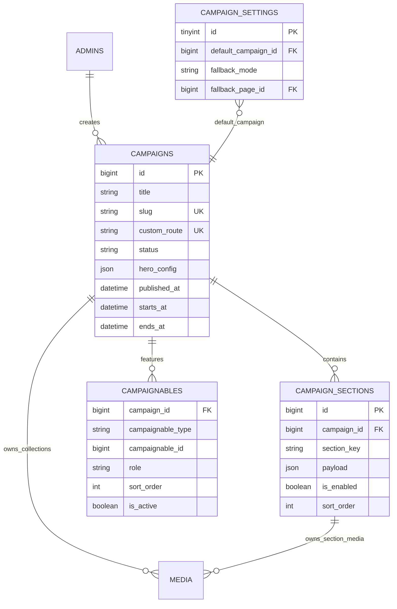

# Database ERD

## 1. Conventions

- Primary keys use `BIGINT UNSIGNED` unless UUID/ULID is selected before implementation.
- All content tables use timestamps; selected tables also use soft deletes.
- Authentication is intentionally split: `admins` uses the `admin` guard for backoffice access, while `users` uses the `web` guard for customers. Spatie roles/permissions are guard-specific and may attach polymorphically to either model.
- Media ownership uses the polymorphic `media` table from `spatie/laravel-medialibrary`.
- Page, Service and Location own independent `hero_desktop` and `hero_mobile` collections.
- Uploaded file bytes are stored outside MySQL.

## 2. Mermaid ER diagram

```mermaid
erDiagram
    ADMINS ||--o{ MODEL_HAS_ROLES : has_admin_roles
    USERS ||--o{ MODEL_HAS_ROLES : has_web_roles
    ROLES ||--o{ MODEL_HAS_ROLES : assigned
    ADMINS ||--o{ MODEL_HAS_PERMISSIONS : admin_direct_permission
    USERS ||--o{ MODEL_HAS_PERMISSIONS : web_direct_permission
    PERMISSIONS ||--o{ MODEL_HAS_PERMISSIONS : assigned
    ROLES ||--o{ ROLE_HAS_PERMISSIONS : grants
    PERMISSIONS ||--o{ ROLE_HAS_PERMISSIONS : included
    USERS ||--o{ LEADS : submits
    ADMINS ||--o{ AUDIT_LOGS : performs_admin_actions
    USERS ||--o{ AUDIT_LOGS : performs_user_actions
    ADMINS ||--o{ POSTS : authors

    MENUS ||--o{ MENU_ITEMS : contains
    MENU_ITEMS ||--o{ MENU_ITEMS : parent_of

    PAGES ||--o{ PAGE_SECTIONS : contains
    SECTION_DEFINITIONS ||--o{ PAGE_SECTIONS : types
    PAGE_SECTIONS ||--o{ SECTION_MEDIA : uses
    MEDIA ||--o{ SECTION_MEDIA : attached

    SERVICES ||--o{ SERVICE_FEATURES : has
    SERVICES ||--o{ SERVICE_LOCATION : available_in
    LOCATIONS ||--o{ SERVICE_LOCATION : offers
    SERVICES ||--o{ PRICING_PACKAGES : prices
    LOCATIONS ||--o{ PRICING_PACKAGES : overrides
    PRICING_PACKAGES ||--o{ PRICING_ITEMS : contains
    PRICING_PACKAGES ||--o{ PRICING_PACKAGE_ADDON : allows
    PRICING_ADDONS ||--o{ PRICING_PACKAGE_ADDON : attached

    GALLERIES ||--o{ GALLERY_ITEMS : contains
    GALLERY_ITEMS ||--o{ MEDIA : owns_named_collections
    VIDEOS ||--o{ MEDIA : owns_video_file_and_poster
    TESTIMONIALS ||--o{ MEDIA : owns_photo_or_screenshot

    FAQS ||--o{ FAQABLES : reused_on
    PAGES ||--o{ FAQABLES : page
    SERVICES ||--o{ FAQABLES : service
    LOCATIONS ||--o{ FAQABLES : location

    CATEGORIES ||--o{ POSTS : classifies
    POSTS ||--o{ MEDIA : owns_featured_and_content_images

    LEADS ||--o{ LEAD_SERVICES : requests
    SERVICES ||--o{ LEAD_SERVICES : selected
    LEADS ||--o{ MEDIA : owns_private_attachments
    LEADS ||--o{ LEAD_STATUS_HISTORIES : changes
    LEADS ||--o{ LEAD_NOTES : has
    ADMINS ||--o{ LEAD_NOTES : writes_admin_notes
    USERS ||--o{ LEAD_NOTES : writes_user_notes

    CONTACT_CHANNELS ||--o{ CONTACT_TARGETS : targeted

    TRACKING_PROVIDERS ||--o{ TRACKING_EVENT_RULES : enables

    SEO_METAS ||--o{ REDIRECTS : informs

    ADMINS {
      bigint id PK
      string name
      string username UK
      string email UK
      string phone UK
      string password
      boolean status
      string photo legacy
    }
    USERS {
      bigint id PK
      string name
      string email UK
      string password
    }
    ROLES {
      bigint id PK
      string name UK
    }
    PERMISSIONS {
      bigint id PK
      string name
      string guard_name
    }
    MODEL_HAS_ROLES {
      bigint role_id FK
      string model_type
      bigint model_id
    }
    MODEL_HAS_PERMISSIONS {
      bigint permission_id FK
      string model_type
      bigint model_id
    }
    ROLE_HAS_PERMISSIONS {
      bigint permission_id FK
      bigint role_id FK
    }
    SITE_SETTINGS {
      bigint id PK
      string group_name
      string setting_key UK
      longtext setting_value
      string value_type
      boolean is_public
    }
    MENUS {
      bigint id PK
      string name
      string location UK
      boolean is_active
    }
    MENU_ITEMS {
      bigint id PK
      bigint menu_id FK
      bigint parent_id FK
      string label
      string link_type
      string url
      int sort_order
      boolean is_active
    }
    PAGES {
      bigint id PK
      string title
      string slug UK
      string template
      string status
      datetime published_at
    }
    SECTION_DEFINITIONS {
      bigint id PK
      string key UK
      string name
      json schema_json
    }
    PAGE_SECTIONS {
      bigint id PK
      bigint page_id FK
      bigint section_definition_id FK
      string heading
      json payload
      int sort_order
      boolean is_active
    }
    MEDIA {
      bigint id PK
      string model_type
      bigint model_id
      string collection_name
      string name
      string file_name
      string mime_type
      string disk
      string conversions_disk
      bigint size
      json custom_properties
      json responsive_images
      int order_column
    }
    SECTION_MEDIA {
      bigint page_section_id FK
      bigint media_id FK
      string role
      int sort_order
    }
    SERVICES {
      bigint id PK
      string name
      string slug UK
      text summary
      longtext content
      string status
    }
    SERVICE_FEATURES {
      bigint id PK
      bigint service_id FK
      string title
      text description
      string icon
      int sort_order
    }
    LOCATIONS {
      bigint id PK
      string name
      string slug UK
      longtext content
      string status
    }
    SERVICE_LOCATION {
      bigint service_id FK
      bigint location_id FK
      json override_data
    }
    PRICING_PACKAGES {
      bigint id PK
      bigint service_id FK
      bigint location_id FK
      string name
      string badge
      boolean is_featured
      int sort_order
    }
    PRICING_ITEMS {
      bigint id PK
      bigint pricing_package_id FK
      string label
      decimal amount
      string price_type
      int sort_order
    }
    PRICING_ADDONS {
      bigint id PK
      string name
      decimal amount
      string price_type
      boolean is_active
    }
    PRICING_PACKAGE_ADDON {
      bigint pricing_package_id FK
      bigint pricing_addon_id FK
    }
    GALLERIES {
      bigint id PK
      string name
      string attachable_type
      bigint attachable_id
      boolean is_active
    }
    GALLERY_ITEMS {
      bigint id PK
      bigint gallery_id FK
      string item_type
      int sort_order
      boolean is_active
    }
    VIDEOS {
      bigint id PK
      string attachable_type
      bigint attachable_id
      string source_type
      string provider
      string source_url
      string processing_status
      int sort_order
      boolean is_active
    }
    TESTIMONIALS {
      bigint id PK
      string type
      string customer_name
      tinyint rating
      text review
      string source
      boolean is_active
      int sort_order
    }
    FAQS {
      bigint id PK
      text question
      longtext answer
      boolean is_active
    }
    FAQABLES {
      bigint faq_id FK
      string faqable_type
      bigint faqable_id
      int sort_order
    }
    CATEGORIES {
      bigint id PK
      string name
      string slug UK
    }
    POSTS {
      bigint id PK
      bigint author_id FK
      bigint category_id FK
      string title
      string slug UK
      longtext body
      string status
      datetime published_at
    }
    CONTACT_CHANNELS {
      bigint id PK
      string type
      string label
      string region
      string value
      text message_template
      boolean is_default
      boolean is_active
      int sort_order
    }
    CONTACT_TARGETS {
      bigint id PK
      bigint contact_channel_id FK
      string targetable_type
      bigint targetable_id
    }
    LEADS {
      bigint id PK
      bigint user_id FK
      string reference UK
      string name
      string email
      string phone
      string status
      json attribution
    }
    LEAD_SERVICES {
      bigint lead_id FK
      bigint service_id FK
    }
    LEAD_STATUS_HISTORIES {
      bigint id PK
      bigint lead_id FK
      string changed_by_type
      bigint changed_by_id
      string from_status
      string to_status
    }
    LEAD_NOTES {
      bigint id PK
      bigint lead_id FK
      string author_type
      bigint author_id
      text note
      boolean visible_to_user
    }
    SEO_METAS {
      bigint id PK
      string seoable_type
      bigint seoable_id
      string meta_title
      text meta_description
      string canonical_url
      string robots
    }
    REDIRECTS {
      bigint id PK
      string from_path UK
      string to_url
      smallint status_code
      boolean is_active
    }
    TRACKING_PROVIDERS {
      bigint id PK
      string provider UK
      string public_identifier
      text encrypted_secret
      boolean is_enabled
      boolean test_mode
    }
    TRACKING_EVENT_RULES {
      bigint id PK
      bigint tracking_provider_id FK
      string internal_event
      string provider_event
      boolean is_enabled
    }
    AUDIT_LOGS {
      bigint id PK
      string actor_type
      bigint actor_id
      string action
      string auditable_type
      bigint auditable_id
      json old_values
      json new_values
    }
```

## 3. Relationship notes

### Authentication domains

`Admin` and `User` are separate authenticatable models. `model_has_roles`/`model_has_permissions` remain polymorphic; `guard_name` prevents admin-guard roles from being used in the web guard. Admin-created content should reference `admins` where a direct FK is appropriate; shared actor histories/audit rows should use constrained polymorphic actor fields when both Admin and User can act.

### Media Picker

Media Picker v1 does not add an entity/table to the ERD. It queries authorized Spatie `media` rows and returns a source media ID to an Admin form. The target service copies the source file into the target owner's named collection, preserving the original owner's media record. Private Lead attachments are excluded from generic picker results.

### Dynamic pages and hero media

Page, Service and Location implement Spatie `HasMedia`. Their `hero_desktop` and `hero_mobile` collections hold independent hero images; Home, Plastering and Hacking do not share media unless the global fallback is intentionally used. Hero text, overlay and CTA values remain in `hero_config` or a validated hero section payload.

`pages` owns ordered `page_sections`. Each section references a controlled `section_definition`; the validated `payload` stores block-specific values. Images are referenced through `section_media`, avoiding raw file paths in JSON where possible.

### Service and location reuse

`services` and `locations` form a many-to-many relationship. `service_location.override_data` stores only approved overrides such as local headline, summary or CTA. Large rich content should remain in explicit content/section records.

### Contact routing

`contact_channels` stores all WhatsApp, phone, email and custom channels. `contact_targets` optionally scopes a channel to a Page, Service or Location. If no scoped channel matches, active global channels are used; the global default is listed first.

### SEO

`seo_metas` is polymorphic so Page, Service, Location, Post and Category can share the same SEO subsystem. Slug changes create a `redirects` entry.

### Leads

A lead can be submitted by a guest or user. Guest identity is stored on `leads`; `user_id` is nullable. Lead owns private Spatie `attachments` media directly; access is enforced through the Lead policy/signed download route.

## 4. Delete behaviour

- `menu_items`: cascade when its menu is deleted.
- `page_sections`: cascade when page is force-deleted.
- `service_features`: cascade with service.
- `pricing_items`: cascade with package.
- `lead_status_histories` and `lead_notes`: restrict or retain for audit.
- `media`: restrict deletion while referenced; allow soft deletion and scheduled cleanup.
- `admins`: prefer deactivation/status disable for operational accounts; soft delete only when appropriate.
- `users`: preserve customer history as required; use deactivation before destructive removal where possible.
- `tracking` and `audit_logs`: retain according to the data-retention policy.


## 5. Spatie ownership rule

The `MEDIA` relation is polymorphic through `model_type` and `model_id`. Implemented direct owners currently include `Admin` (`avatars`) and `SiteSetting` (`site_logo`, `site_favicon`, `default_hero`). Planned direct owners include Page, Service, Location, Post, GalleryItem, Video, Testimonial, Lead, Campaign and eligible CampaignSection assets. Keep a separate pivot such as `section_media` only when intentional reuse/role ordering is required.

## 6. Campaign ERD extension



### Default campaign invariant

`campaign_settings` is a singleton and contains one nullable `default_campaign_id`. The UI may render a Set/Default switch on each campaign row, but it must call a transactional `SetDefaultCampaign` action rather than updating independent flags. Only active, published and non-expired campaigns qualify.

### Campaign media ownership

Campaign uses Spatie collections `hero_images`, `hero_video`, `hero_video_poster` and `social_image`. CampaignSection may implement `HasMedia` for section-specific assets. Hero resolution checks embed video first, ordered `hero_images` second, uploaded `hero_video` third and fallback image last.

### Section visibility

Public queries use `campaign_sections.is_enabled = true` and `sort_order`. Inactive section rows and media remain available in admin editing but are omitted from frontend HTML and structured data. Allowlisted keys are `hero`, `hero_benefits`, `service_grid`, `category_brand`, `pricing`, `gallery`, `video_gallery`, `testimonials`, `whatsapp_reviews`, `faq`, `cta`, and `lead_form`; every key must map to a validated Blade component.
