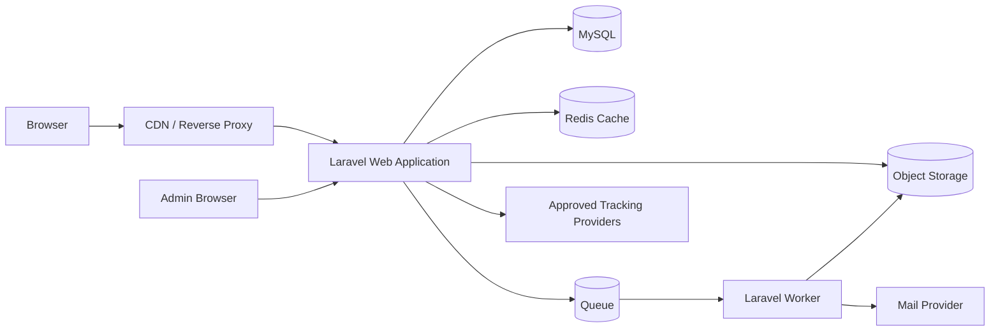

# Application Architecture

## 1. Architectural style

Use a modular Laravel monolith. This keeps the initial system simple while enforcing domain boundaries through controllers, Form Requests, policies, actions/services, events and jobs. Avoid premature microservices.

## 2. Current project stack and target runtime

The actual repository is the source of truth for framework/package versions:

- PHP `^8.3`
- Laravel Framework `^13.17`
- `jeroennoten/laravel-adminlte` `3.16.0` for the backoffice UI
- `laravel/ui` `4.6.3` for the current authentication scaffolding
- `spatie/laravel-permission` `8.3`
- `spatie/laravel-medialibrary` `11.23`
- MySQL 8+ for production (the repository may use SQLite locally/tests)
- Admin UI: Blade + AdminLTE 3 + Bootstrap/jQuery
- Public UI: Blade + Vite; Tailwind CSS 4 is already available in the asset pipeline
- Alpine.js is optional/planned only where lightweight public interactivity benefits from it; it is not a required installed dependency today
- Redis cache/queue in production where available
- S3-compatible object storage for production media when needed
- Nginx + PHP-FPM
- Supervisor/systemd for queue workers
- Scheduler cron every minute
- Optional FFmpeg for uploaded-video processing

Do not downgrade the implemented framework version or redesign authentication merely to match an older planning document.

## 3. High-level diagram



## 3.1 Installed package baseline

The repository already includes the core packages. New setup should respect the versions pinned by `composer.json`/`composer.lock` instead of reinstalling arbitrary versions.

Useful verification commands:

```bash
composer install
php artisan --version
php artisan migrate:status
php artisan permission:cache-reset
```

Package migrations/configuration should be changed only when required by the current project implementation. The existing permission migration intentionally includes `group_name`, timestamps and soft deletes for roles/permissions.

## 4. Application layers

### 4.1 Presentation

- Public Blade views/components
- Admin Blade views under `resources/views/backoffice/admin` using AdminLTE 3
- Public Blade views/components; Alpine/native controllers may be added later for menu, contact widget, slider, FAQ and back-to-top
- ViewModels/resource objects where templates would otherwise contain queries

### 4.2 HTTP/application

- Thin controllers
- Form Request validation and authorization
- Action classes for meaningful use cases
- API Resources only where JSON endpoints are required
- Spatie Permission middleware/permission checks plus policies for entity-level authorization

### 4.3 Domain/services

Suggested services/actions:

- `ResolvePublishedPage`
- `RenderPageSections`
- `ResolveContactChannels`
- `CreateLead`
- `UpdateLeadStatus`
- `PublishContent`
- `StoreMedia`
- `ProcessUploadedVideo`
- `BuildSeoMetadata`
- `DispatchTrackingEvent`
- `InvalidateContentCache`

### 4.4 Persistence

- Eloquent models and relationships
- Query scopes for `published`, `active`, `ordered`
- Transactions for multi-table writes
- Database constraints/indexes as the final integrity boundary

## 5. Routing design

### Public routes

- `/`
- `/services`
- `/services/{service:slug}`
- `/locations/{location:slug}`
- `/pricing`
- `/gallery`
- `/blog`
- `/blog/{post:slug}` or `/{post:slug}` only if collision strategy is defined
- `/contact`
- `/quote`
- `/privacy-policy`
- `/sitemap`

Public URL policy:
- Typed routes (`/services/{service:slug}`, `/locations/{location:slug}`, `/blog/{post:slug}`) are the canonical default because they avoid root-level slug collisions.
- If SEO migration requires a legacy/reference-style path such as `/house-painting-{location}` or another marketing alias, register it explicitly or through the redirect/alias subsystem; do not add an unrestricted catch-all root slug.
- Canonical metadata must always point to one preferred URL.

### User routes

Prefix `/account`, middleware `auth`, `verified` where enabled:

- profile
- enquiries
- enquiry detail
- attachment download through authorization

### Admin routes

Current routing is intentionally guard-isolated:

1. `routes/web.php` mounts the `/admin` prefix and applies `lte_context:admin`.
2. Laravel UI admin auth routes are registered inside that prefix with registration disabled.
3. `routes/admin.php` contains the authenticated backoffice CRUD routes and is protected by `auth:admin`.
4. `routes/command.php` exposes protected system tools under `/admin/command` and requires `auth:admin` plus `can:system_tools_manage`.
5. New admin modules must continue using the `admin` guard and granular Spatie permissions/policies.

Current/future admin modules include:

- dashboard, profile, admins, roles, permissions
- settings and menus
- pages and sections
- services, locations and pricing
- media, galleries and videos
- testimonials, FAQs and posts
- contact channels and leads
- SEO, redirects and tracking
- campaigns and audit logs

Route model binding must use slugs only on public routes and IDs/ULIDs where appropriate in admin routes.

## 5.1 Authentication and authorization

The implemented project uses **two authenticatable models and two guards**. This is now the canonical architecture.

### Admin/backoffice

- Model: `App\Models\Admin`
- Table: `admins`
- Guard/provider: `admin` / `admins`
- Password broker: `admins`
- `Admin` uses `HasRoles` with `protected string $guard_name = 'admin'`.
- Admin roles/permissions use `guard_name = admin`.
- Current seeded admin role is `admin`; permissions are granular and grouped.
- Backoffice routes use `auth:admin`; sensitive routes also require `can:*`/permission checks.
- `status` exists on `admins`; an active-admin middleware may be added before production if disabled accounts must be rejected at request entry.

### Customer/user portal

- Model: `App\Models\User`
- Table: `users`
- Guard/provider: `web` / `users`
- Password broker: `users`
- The current `User` model is still the minimal Laravel user model. The customer portal can add `HasRoles` for the `web` guard when user-side granular permissions are actually enforced.
- Customer ownership policies remain mandatory for enquiries and private attachments.

### Spatie rules

- Roles and permissions are guard-specific; never assign an `admin`-guard role to the `web` guard or vice versa.
- The project extends Spatie `Role` and `Permission` and intentionally uses soft deletes; the current permission migration contains the required `deleted_at` columns.
- Do not replace the working separate Admin guard with a single-User design.
- Reset Spatie's permission cache after role/permission mutations and deployment seeding.

## 6. Dynamic page rendering

1. Route resolves a Page, Service, Location or Post.
2. Published scope enforces status and publication time.
3. Application resolves ordered active sections.
4. Each section key maps to a known Blade component.
5. Payload is validated when saved, not trusted at render time.
6. Section keys are allowlisted and map to known components; `whatsapp_reviews`, `paint_calculator`, `safe_embed` and `spacer` are first-class normal-page section types.
7. Spatie media collections provide URLs, conversions and responsive variants.
8. SEO builder creates metadata and schema.
9. Cached output/data is invalidated when related content changes.

Do not execute arbitrary PHP/Blade/JavaScript stored in the database.

## 7. Header, footer and hero architecture

- `HeaderComposer` loads cached branding, top bar and `header-primary` menu.
- A `HeroResolver` receives the current Page/Service/Location and resolves Spatie collections in this order: `hero_desktop`/`hero_mobile` on the entity, template/service default, global default.
- Home, Plastering, Hacking and other service pages therefore render independent dynamic images.
- Cache keys include entity type, entity ID, locale and hero/media update version to prevent cross-page image leakage.
- Hero media conversions include desktop, tablet/mobile and social preview sizes.
- `FooterComposer` loads cached footer settings and menu groups.
- Menu trees are built once and cached by location.
- Model observers/events invalidate menu/global-layout cache after mutations.
- Public templates render components such as `<x-site.header />` and `<x-site.footer />`.

## 8. Floating contact widget architecture

### Server side

`ResolveContactChannels` accepts current page/service/location context and returns:

1. Matching active targeted channels
2. Active global fallback channels
3. Default channel first
4. Remaining channels by sort order

Only safe public fields are serialized to the Blade component.

### Client side

An Alpine component manages:

- `open`: launcher expanded/collapsed
- `whatsappOpen`: WhatsApp list visible
- Escape/outside-click close
- Focus return to launcher
- Click event dispatch
- Responsive popover/bottom sheet

Generated WhatsApp URL:

```text
https://wa.me/{digits_only_e164}?text={url_encoded_message}
```

Never hard-code numbers in Blade or JavaScript. Message placeholders may include safe values such as page title, service and location; unresolved placeholders must be removed.

### Back-to-top

A separate lightweight Alpine/native controller:

- observes `window.scrollY`
- toggles visibility after configured threshold
- calls `window.scrollTo({ top: 0, behavior })`
- uses `behavior: auto` for reduced-motion users

## 9. Media architecture

Use Spatie Media Library as the canonical file/media layer. The package `media` table remains the only generic media table. Domain models own named collections; do not store raw public file paths as the primary relationship for new features.

### Implemented collections

- `Admin`: `avatars` (single file, public disk). The legacy `admins.photo` column is compatibility-only and is cleared when a Spatie avatar is saved.
- `SiteSetting`: `site_logo`, `site_favicon`, `default_hero` (single-file public collections).

### Planned collections

- `Page`, `Service`, `Location`: `hero_desktop`, `hero_mobile`, `gallery`
- `Post`: `featured`, `content_images`
- `GalleryItem`: `image`, `before`, `after`
- `Video`: `video_file`, `video_poster`
- `Testimonial`: `photo`, `testimonial_screenshot`
- `Lead`: private `attachments`
- `SeoMeta`: optional `social_image`
- `Campaign`: `hero_images`, `hero_video`, `hero_video_poster`, `social_image`

Direct Spatie ownership is preferred. A separate pivot such as `section_media` is justified only when a page section intentionally references/reorders existing media without becoming the owner.

### 9.1 Media Picker — next implementation milestone

The next feature before the Page models is a reusable backoffice Media Picker.

**Current state:** Admin avatar and Site Setting forms already contain `*_media_id` fields and call `MediaPicker.open(...)`; `AdminAvatarService` and `SiteSettingMediaService` already accept a selected Spatie media ID. The global picker object/modal/list endpoint does not yet exist, so the feature is incomplete.

**Version 1 scope:**

- Browse existing authorized Spatie `media` records in an AdminLTE modal.
- Search by name/file name and filter by MIME type/collection where useful.
- Paginate results; do not load the full library into one response.
- Image fields can restrict selection to image MIME types.
- Return only safe metadata such as `id`, name, MIME, size, collection, preview URL and created time.
- Exclude private lead attachments and other private/sensitive collections from the generic picker unless a dedicated authorized context explicitly allows them.
- Require `auth:admin` and `media_list`/`media_view` permissions.
- Keep the existing JavaScript contract backward-compatible: `MediaPicker.open(callback, options = {})`.
- Picker v1 is primarily **select/reuse**. Existing form upload inputs remain responsible for new uploads; a standalone global-library upload workflow can be designed later if required.

**Selection semantics:** a selected media row is a source asset. Services such as `AdminAvatarService` and `SiteSettingMediaService` copy the selected file into the target model's own named collection rather than transferring the source media row's ownership. This matches Spatie's single-owner polymorphic model and prevents one module from unexpectedly stealing another module's file.

No additional database table is required for Media Picker v1.

### Images

1. Validate file size, extension and detected MIME/signature server-side.
2. Store through the owning model's named Spatie collection.
3. Generate safe filenames.
4. Store descriptive metadata in `custom_properties` where needed.
5. Queue expensive responsive/conversion work.
6. Render public media with width/height, lazy loading and responsive variants where available.

### Uploaded videos

1. Validate MP4/WebM and configured maximum size/duration.
2. Store original on private/pending path when processing is required.
3. Queue probe/transcode operations if enabled.
4. Generate poster/metadata.
5. Mark `ready` and expose only the final authorized/public URL.
6. Record safe failures and notify Admin.

### Embedded videos

- Accept only allowlisted YouTube/Vimeo URL formats.
- Extract provider IDs server-side.
- Render privacy-enhanced embeds where practical.
- Lazy-load iframe content after interaction/proximity.

## 10. Lead architecture

`CreateLead` performs:

1. Rate-limit and anti-spam verification.
2. Server-side validation.
3. Transaction: lead, services, attribution and attachments.
4. Status-history creation.
5. Commit.
6. Queue admin/customer notifications.
7. Dispatch internal `LeadCreated` event.
8. Trigger browser/server tracking using a shared event ID where applicable.

Attachments remain private and are served through policies/signed routes.

## 11. Tracking architecture

### Configuration

- Admin selects provider and enters validated IDs.
- Secrets use encrypted model casts/config storage.
- Raw JavaScript injection is disabled by default.
- Public layout receives only enabled public identifiers.

### Internal event bus

Frontend and backend use stable internal names:

- `page_view`
- `view_content`
- `view_pricing`
- `contact`
- `click_whatsapp`
- `click_call`
- `submit_quote`
- `lead`

Provider adapters map internal events to Meta/GA/TikTok names.

### Meta Pixel and CAPI

- Browser Pixel handles page/interaction events after required consent.
- Optional CAPI sends qualified server events from queued jobs.
- Browser and server events share `event_id` for deduplication.
- Never send passwords, message bodies, or unapproved personally identifiable information.

## 12. SEO architecture

- `SeoMetadataBuilder` merges global defaults with entity-specific metadata.
- Canonical generation uses trusted application URL and route models.
- JSON-LD is generated from structured fields, not arbitrary admin JSON unless strictly validated.
- Sitemap query includes published, indexable Pages, Services, Locations and Posts.
- Slug changes can create 301 redirects transactionally.
- Breadcrumb component and schema use the same hierarchy source.

## 13. Security architecture

- CSRF middleware for web forms.
- Form Requests for validation and authorization.
- Policies for all admin/user resources.
- `fillable` allowlists or guarded models with controlled DTO/action input.
- Sanitized rich text allowlist.
- Upload signature/MIME checks and safe extensions.
- Private lead attachments.
- Rate limits for login, password reset, quote and tracking endpoints.
- Security headers: CSP, HSTS, X-Content-Type-Options, Referrer-Policy and frame policy.
- Encrypted tokens and redacted logs/audit values.
- Dependency and vulnerability checks in CI.

## 14. Caching and invalidation

Cache candidates:

- Global public settings
- Header/footer menus
- Contact channels
- Published page/service/location data
- Pricing packages
- FAQ/testimonial lists
- Sitemap document

Use tagged cache where supported. Invalidate through domain events/observers after successful commits. Do not cache authenticated user-specific pages publicly.

## 15. Queue and scheduler

Queued jobs:

- Image conversion
- Video processing
- Lead notifications
- Meta CAPI dispatch
- Sitemap regeneration/warming
- Expired media cleanup

Scheduled tasks:

- Publish scheduled posts/pages
- Retry/alert failed media processing
- Prune sessions, temporary uploads, old click logs and audit data per policy
- Backup and health checks as deployment tooling permits

## 16. Testing strategy

### Feature tests

- Admin guard isolation and Admin permission authorization
- Customer/web guard ownership authorization
- Media Picker list/search/filter/permission/private-media exclusion
- CRUD validation
- Publication visibility
- Contact-target resolution
- Spatie role/permission enforcement and permission-cache behaviour
- Entity-specific hero resolution and fallback
- Lead submission and attachment access
- Tracking enable/disable and consent rules
- Redirect and sitemap behavior

### Unit tests

- WhatsApp URL/message generation
- Pricing display formatter
- SEO metadata merge
- Contact sorting/fallback
- Tracking provider mapping

### Browser tests

- Responsive menu
- Floating launcher expand/close
- WhatsApp list rendering
- Back-to-top threshold and action
- Slider, FAQ and before/after controls
- Quote submission

### Security tests

- Stored/reflected XSS
- Unauthorized media access
- Malicious uploads
- IDOR against enquiries
- Rate limiting and CSRF

## 17. Deployment topology

Minimum production:

- Nginx
- PHP-FPM application
- MySQL
- Queue worker
- Scheduler cron
- Object storage/CDN
- TLS certificate
- Central logs/error monitoring
- Automated database and media backups

Deployment order:

1. Maintenance-safe release directory
2. Composer install and frontend build
3. Configuration/cache warmup
4. Backward-compatible migrations
5. Symlink/current release switch
6. Queue restart
7. Health and smoke tests

## 18. Campaign architecture

### Campaign resolution

- Public campaign routes resolve only published, active, started and non-expired records.
- The user-panel campaign slot calls `ResolveDefaultCampaign`.
- `ResolveDefaultCampaign` reads the singleton `campaign_settings.default_campaign_id`, verifies eligibility and returns the configured fallback when invalid.
- Cache keys include campaign ID, update timestamp/version and audience context.

### Setting the default campaign

`SetDefaultCampaign` performs:

1. Authorize `set default campaign` through Spatie Permission.
2. Validate that the campaign is active, published and within its schedule.
3. Start a database transaction.
4. Lock the singleton `campaign_settings` row for update.
5. Replace `default_campaign_id`.
6. Commit and invalidate default/user-panel caches.
7. Record an audit log.

This prevents concurrent requests from creating conflicting defaults.

### Campaign section rendering

- `Campaign` owns ordered `CampaignSection` records.
- Admin editor shows a toggle for every section.
- Public repository queries only `is_enabled = true` sections.
- Section keys map to allowlisted Blade components; payload schemas are validated on write.
- Disabled sections preserve data but do not render or emit tracking/schema.

### Campaign hero resolver

`CampaignHeroResolver` returns the first valid source:

1. Allowlisted active embed video
2. Ordered Spatie `hero_images`
3. Ready Spatie `hero_video`
4. Campaign or global fallback image

The resolver returns a typed ViewModel so Blade does not contain priority logic.

### Video playback rules

- `autoplay`, `muted`, `controls` and `loop` are stored as booleans in validated hero configuration.
- Autoplay with sound is blocked by many browsers. Server validation forces `muted = true` for autoplay, or turns autoplay off and ensures controls are visible.
- Render `playsinline` for mobile.
- Embedded provider parameters are generated server-side from allowlisted options.
- Lower-priority media should not be eagerly loaded when a higher-priority source is selected.
- User interaction can unmute only when controls/provider API support it.

### Campaign cache invalidation

Invalidate campaign/default caches after:

- Campaign status/schedule/content change
- Default selection change
- Section toggle/reorder/update
- Campaign media add/remove/reorder/conversion completion
- Campaign expiry scheduler transition

### Campaign testing

- Default uniqueness under concurrent requests
- Draft/inactive/expired campaign exclusion
- User panel default/fallback behaviour
- Section Active/Inactive persistence and frontend omission
- Embed → slider → uploaded-video → fallback priority
- Autoplay/muted browser-policy validation
- Per-campaign media/settings isolation
- Spatie permission checks for campaign actions
